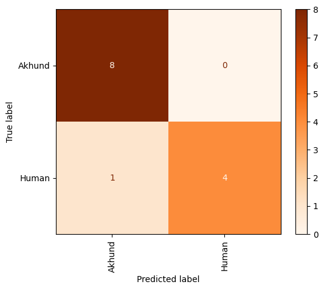

# Human VS Akhund recognition using wandb


# Description 

Here , i have used `InceptionResNetV2` architecture . <br />
we use pre-trained weights on `imagenet` dataset. <br />
we will assign `include_top=False` to remove the upper Fully-connected layers , then add a Flatten layer , and Dense layers . <br />
input_shape of this architecture must be (299,299,3) :
```
model = tf.keras.applications.InceptionResNetV2(weights="imagenet" , include_top=False , input_shape=(299,299,3)) 
```
+ ### here we have used `wandb` visualizing tool , to supervise the loss and accuracy results at a time . 


# How to install 
```
pip install -r requirements.txt 
```


# How to run 


You only need to Run `files.ipynb` . At the end of the code , in inference part , corresponding predicted labels are shown .  


# RESULTS 
Here is the loss and accuracy results : <br />

## confusion matrix and loss-acc diagram for Human VS Akhund recognition :
<p float="center">
     
</p>
<br />

