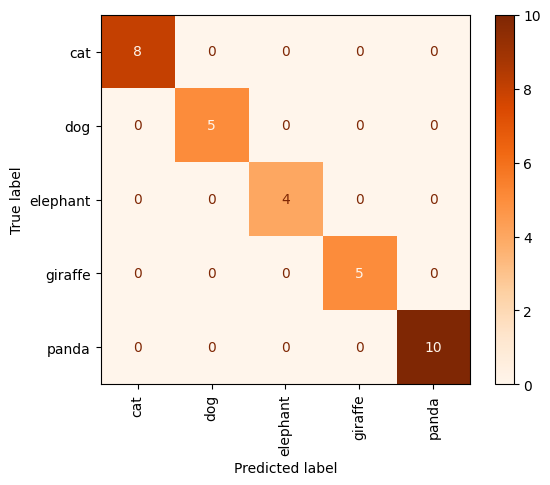

# Different recognition tasks using wandb


# Description 

Here , i have used `InceptionResNetV2` architecture . <br />
we use pre-trained weights on `imagenet` dataset. <br />
we will assign `include_top=False` to remove the upper Fully-connected layers , then add a Flatten layer , and Dense layers . <br />
input_shape of this architecture must be (299,299,3) :
```
model = tf.keras.applications.InceptionResNetV2(weights="imagenet" , include_top=False , input_shape=(299,299,3)) 
```
+ ### here we have used `wandb` visualizing tool , to supervise the loss and accuracy results at a time . 
we are going to have 3 recognition tasks , with 3 different below datasets :

1)   `7-7 faces` : contains 14 classes of men and women aligned faces  
2)   `5 naimals` : contains 5 classes of animals
3)   `17 flowers` : contains 17 classes of flowers


# How to install 
```
pip install -r requirements.txt 
```


# How to run 


You only need to Run `files.ipynb` . At the end of the code , in inference part , corresponding predicted labels are shown .  


# RESULTS 
Here is the loss and accuracy results : <br />
<br />
| Layers Freezed|without Dropout| with Droput = 0.2 |with Droput = 0.5 |
| ------------- | :-------------: | :-------------: |:-------------: |
| validation Accuracy  | 0.9766  | 0.9922  | 0.9766  |

<br />

|without Freezing layers|without Dropout| with Droput = 0.2 | with Droput = 0.5 |
| ------------- | :-------------: | :-------------: | :-------------: |
| validation Accuracy  | 1.0000  | 0.9609  | 1.0000  |

<br />


## confusion matrix and loss-acc diagram for 5-animal recognition :
<p float="center">
     
</p>
<br />

## confusion matrix and loss-acc diagram for 17-flowers recognition :
<p float="center">
     
</p>